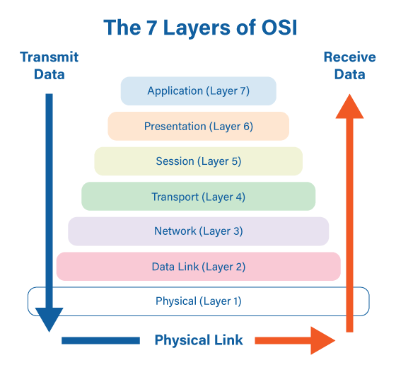

# internet protocols

Common phrases:

- Ethernet: is a family of wired computer networking technologies commonly used in local area networks (LANs), metropolitan area networks (MANs), and wide area networks (WANs).
- Network classified by:
	- area: LAN, MAN, WAN
	- internal: open, private
	- bus, star
- OSI model: Open Systems Interconnection is a networking model framework (networking protocol) that describe how data transferred between computer systems on a network. It's like cache layer and each one is responsible for a specific function. This is a framework and not an implementation.

Other content goes here!

# implementation in OSI layers

The OSI (Open Systems Interconnection) model is a conceptual framework that helps in understanding and designing network architectures. Various protocols are associated with different layers of the OSI model. Here are some examples:

1. **Physical Layer (Layer 1):**
   - Ethernet (IEEE 802.3)
   - USB (Universal Serial Bus)

2. **Data Link Layer (Layer 2):**
   - Point-to-Point Protocol (PPP)
   - Ethernet (IEEE 802.3)
   - Wi-Fi (IEEE 802.11)

3. **Network Layer (Layer 3):**
   - Internet Protocol (IP)
   - Internet Control Message Protocol (ICMP)

4. **Transport Layer (Layer 4):**
   - Transmission Control Protocol (TCP)
   - User Datagram Protocol (UDP)

5. **Session Layer (Layer 5):**
   - NetBIOS (Network Basic Input/Output System)

6. **Presentation Layer (Layer 6):**
   - Hypertext Transfer Protocol (HTTP)
   - Simple Object Access Protocol (SOAP)

7. **Application Layer (Layer 7):**
   - File Transfer Protocol (FTP)
   - Simple Mail Transfer Protocol (SMTP)

These are just examples, and there are many other protocols that align with different layers of the OSI model. The model helps in conceptualizing the interactions and functions of these protocols in a systematic way.

# OSI model:

The Open Systems Interconnection (OSI) model is a conceptual framework that standardizes the functions of a network into seven categories or layers. These layers are: Physical, Data Link, Network, Transport, Session, Presentation, and Application. This model is used to understand and describe how different network protocols interact and work together to provide network services [Source 1](https://en.wikipedia.org/wiki/OSI_model), [Source 2](https://aws.amazon.com/what-is/osi-model/), [Source 3](https://www.techtarget.com/searchnetworking/definition/OSI), [Source 4](https://www.forcepoint.com/cyber-edu/osi-model).

- **Physical Layer**: This is the lowest layer of the OSI model. It deals with the physical characteristics of the transmission medium like voltage levels, cable specifications, pin layouts, etc. It includes elements like network cables, hubs, and repeaters [Source 4](https://www.forcepoint.com/cyber-edu/osi-model).

- **Data Link Layer**: This layer provides reliable transfer of frames from one node to another, handling errors that may occur in the Physical layer. It controls how a computer on a network sends and receives data [Source 1](https://en.wikipedia.org/wiki/OSI_model).

- **Network Layer**: This layer is responsible for packet forwarding, including routing through different networks. It selects the best path for data transfer [Source 1](https://en.wikipedia.org/wiki/OSI_model).

- **Transport Layer**: This layer manages error checking and recovery, flow control, and ensures data integrity. It handles the segmentation and reassembly of data packets [Source 1](https://en.wikipedia.org/wiki/OSI_model).

- **Session Layer**: This layer establishes, manages, and terminates connections between applications. It coordinates communication sessions between computers [Source 1](https://en.wikipedia.org/wiki/OSI_model).

- **Presentation Layer**: This layer transforms data into a format that the application layer can accept. It provides a common format for data exchange [Source 1](https://en.wikipedia.org/wiki/OSI_model).

- **Application Layer**: This is the topmost layer of the OSI model where the interface to the software application exists. It provides a set of interfaces for applications to access network services [Source 1](https://en.wikipedia.org/wiki/OSI_model).

The OSI model is important because it provides a common language for computer networking, allowing different technologies to communicate using standard protocols. It encapsulates every type of network communication across both software and hardware components, allowing two standalone systems to communicate via standardized interfaces or protocols [Source 2](https://aws.amazon.com/what-is/osi-model/).

*7 layers of OSI model*

Let's consider a practical scenario to illustrate how the OSI model works. Suppose you want to visit a website. Here's how the OSI model comes into play:

1. **Application Layer**: You open a web browser and type in the URL of the website you want to visit. The application layer handles this request [Source 4](https://study.com/academy/lesson/osi-model-using-open-systems-interconnection-to-send-and-receive-data.html).

2. **Presentation Layer**: The data that makes up the website (like text, images, videos, etc.) is formatted and presented in a way that your browser can understand [Source 4](https://study.com/academy/lesson/osi-model-using-open-systems-interconnection-to-send-and-receive-data.html).

3. **Session Layer**: Your browser initiates a session with the server hosting the website. This layer is responsible for setting up, maintaining, and terminating the session [Source 4](https://study.com/academy/lesson/osi-model-using-open-systems-interconnection-to-send-and-receive-data.html).

4. **Transport Layer**: The data from your browser is broken down into smaller pieces called segments, which are then sent over the network. This layer ensures that the data arrives reliably and in the correct order [Source 4](https://study.com/academy/lesson/osi-model-using-open-systems-interconnection-to-send-and-receive-data.html).

5. **Network Layer**: These segments are then grouped into packets and sent to the server. The network layer determines the best route for these packets to take to reach the server [Source 4](https://study.com/academy/lesson/osi-model-using-open-systems-interconnection-to-send-and-receive-data.html).

6. **Data Link Layer**: The packets are then converted into frames, which are sent over the physical medium (like your home Wi-Fi or cellular network). This layer also handles error correction if any corruption occurs during transmission [Source 4](https://study.com/academy/lesson/osi-model-using-open-systems-interconnection-to-send-and-receive-data.html).

7. **Physical Layer**: Finally, the frames are converted into electrical signals (or radio waves in the case of cellular networks) that can be transmitted over the network. This layer is responsible for the actual physical transmission of data [Source 4](https://study.com/academy/lesson/osi-model-using-open-systems-interconnection-to-send-and-receive-data.html).

Once the server receives the request, it goes through the same layers in reverse to send the requested webpage back to your browser. The OSI model helps us understand how all these processes fit together to enable us to browse the web.

# CSMA/CD vs TCP/IP

- note that modern Ethernet networks are built with switches and full-duplex connections, which means CSMA/CD is no longer used

CSMA/CD (Carrier Sense Multiple Access with Collision Detection) and TCP/IP (Transmission Control Protocol/Internet Protocol) are both integral parts of network communication, but they operate at different layers of the network model and serve different purposes.

CSMA/CD is a network protocol used primarily at the Data Link layer (Layer 2) of the OSI model. Its role is to manage data transmission in Ethernet networks. It operates by checking if the network medium is free before attempting to send data. If a collision is detected (two devices trying to send data simultaneously), it stops the transmission, waits for a random period, and then tries to retransmit the data [Source 0](https://copperhilltech.com/blog/industrial-ethernet-guide-ethernet-csmacd-tcpip-and-udp/), [Source 1](https://study-ccna.com/csma-cd/).

On the other hand, TCP/IP operates at the Network and Transport layers (Layers 3 and 4) of the OSI model. TCP/IP is responsible for how data is packaged, addressed, transmitted, routed, and received on the internet. TCP/IP works on top of Ethernet, including its CSMA/CD component [Source 0](https://copperhilltech.com/blog/industrial-ethernet-guide-ethernet-csmacd-tcpip-and-udp/).

TCP/IP is made up of two protocols: TCP (Transmission Control Protocol) and IP (Internet Protocol). TCP is a connection-oriented protocol, meaning a connection must be established before data transfer can begin. It also ensures that data is received in the correct order and implements flow control to prevent a message overflow. IP, on the other hand, is a connectionless protocol, meaning it doesn't establish a connection before sending data. It simply sends data to the destination IP address without concern for whether the data arrives in the correct order or at all [Source 0](https://copperhilltech.com/blog/industrial-ethernet-guide-ethernet-csmacd-tcpip-and-udp/).

In summary, while CSMA/CD is concerned with managing data transmission on the local network level, TCP/IP handles the larger picture of data transmission, routing, and delivery on the internet. Both protocols are necessary for the smooth operation of network communication.

