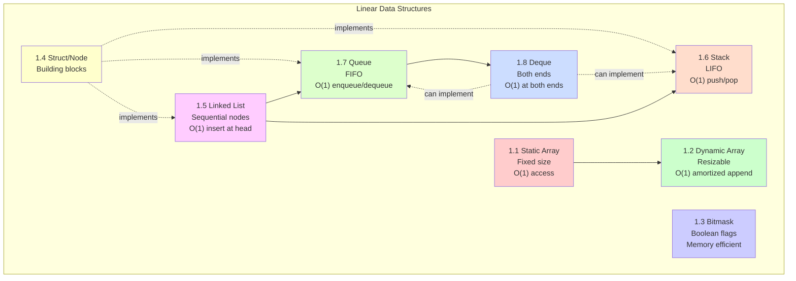
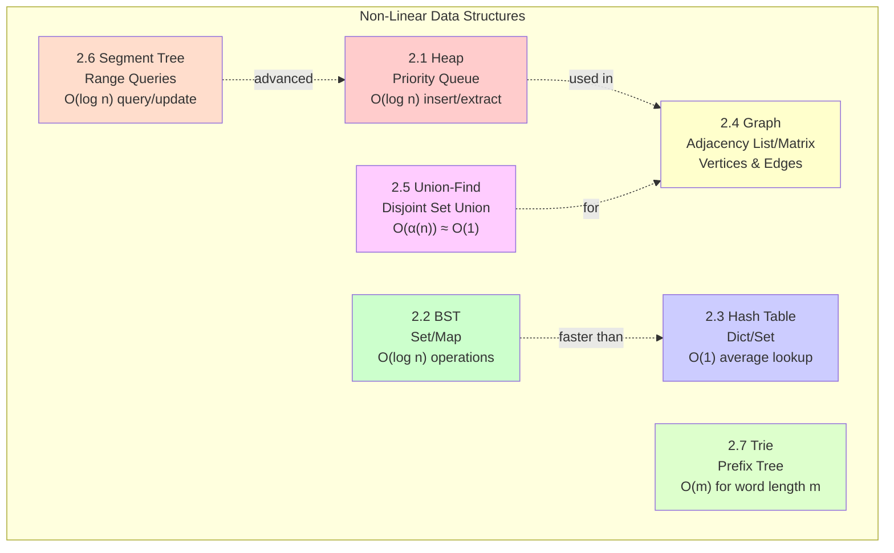

> 🍏: easy, 🫐:medium, 🍊: hard

# 1. linear ds

Linear data structures organize elements in a sequential manner where each element is connected to its previous and next element.



## 🍏 1.1 static array

Sometimes, to limit the array that we are creating. Don't want to mutate it during runtime so static array is the good choice.

In C++ we have `int arr[]`:

```cpp
// one direction
int myNum[3] = {10, 20, 30};
string cars[4] = {"Volvo", "BMW", "Ford", "Mazda"};

// two directions
string letters[2][4] = {
  { "A", "B", "C", "D" },
  { "E", "F", "G", "H" }
};

// sort array using std library
int arr[] = {4,5,1,2,3};
sort(arr, arr+n); // arr: first address, arr+n: last address
```

**Time Complexity:**
- Access: O(1)
- Search: O(n)
- Insertion/Deletion: N/A (fixed size)

In Python we have a data structure called `tuple`:

```python
# Creating tuples
static_array = (1, 2, 3, 4, 5)
tuple_of_strings = ("apple", "banana", "cherry")

# Accessing elements
print(static_array[0])     # 1
print(static_array[-1])    # 5 (last element)

# Tuples are immutable
# static_array[0] = 10     # This will raise TypeError

# Unpacking
a, b, c = (1, 2, 3)

# Tuple methods
numbers = (1, 2, 3, 2, 4, 2)
print(numbers.count(2))    # 3 (count occurrences)
print(numbers.index(3))    # 2 (find first index)
```

## 🍏 1.2 dynamic array

Dynamic array is good for cases that we don't know exactly the length of it in the future. Access an element will have O(1) time, as the new array will be allocated if it reaches a limit in the memory. It's different from a Linked List to have a Node everywhere in the memory.

In C++ we have `vector<int>`:

```cpp
// initializer list
vector<int> vector1 = {1, 2, 3, 4, 5};
vector1.push_back(6);
vector1.at(0) = 2; // change the first element
vector1.pop_back(); // remove the last element

// sort a vector using std library
vector<int> vector2 = {3,4,5,2,1};
sort(vector2.begin(), vector2.end())
```

**Time Complexity:**
- Access: O(1)
- Search: O(n)
- Append: O(1) amortized
- Insert: O(n)
- Delete: O(n)

In Python we use `list` (internally a dynamic array with automatic resizing):

```python
# Creating dynamic arrays
dynamic_array = [1, 2, 3, 4, 5]
empty_list = []

# Adding elements
dynamic_array.append(6)           # Add to end: [1, 2, 3, 4, 5, 6]
dynamic_array.insert(0, 0)        # Insert at index 0
dynamic_array.extend([7, 8, 9])   # Extend with another list

# Removing elements
dynamic_array.pop()               # Remove and return last element
dynamic_array.pop(0)              # Remove element at index 0
dynamic_array.remove(3)           # Remove first occurrence of value 3

# Accessing and slicing
print(dynamic_array[0])           # First element
print(dynamic_array[-1])          # Last element
print(dynamic_array[1:4])         # Slicing: elements from index 1 to 3

# Useful operations
print(len(dynamic_array))         # Length
print(5 in dynamic_array)         # Check if exists
dynamic_array.sort()              # Sort in-place
dynamic_array.reverse()           # Reverse in-place

# List comprehension
squares = [x**2 for x in range(10)]
evens = [x for x in range(20) if x % 2 == 0]
```

We can see C++ `vector` is quite similar to Python `list`.

## 🍊 1.3 bitmask

**Bitmask** uses individual bits in an integer to represent boolean flags or sets, providing memory-efficient storage and fast operations.

**Use cases:**
- Multiple boolean flags or settings
- Memory-efficient solution (32 flags in one int)
- Fast set operations
- Subset generation

**Bitwise Operations:**

| Operation | Description                | Example                |
| --------- | -------------------------- | ---------------------- |
| `x \| y`   | Bitwise OR (sets bits)     | `5 \| 3 = 7` (101 \| 011 = 111) |
| `x & y`   | Bitwise AND (checks bits)  | `5 & 3 = 1` (101 & 011 = 001) |
| `x ^ y`   | Bitwise XOR (toggles bits) | `5 ^ 3 = 6` (101 ^ 011 = 110) |
| `~x`      | Bitwise NOT (flips bits)   | `~5 = -6` (in two's complement) |
| `x << n`  | Left shift by `n` bits     | `5 << 1 = 10` (101 << 1 = 1010) |
| `x >> n`  | Right shift by `n` bits    | `5 >> 1 = 2` (101 >> 1 = 10) |

**Python Bitmask Examples:**

```python
# Common bitmask operations
def set_bit(mask, i):
    """Set the i-th bit to 1"""
    return mask | (1 << i)

def clear_bit(mask, i):
    """Set the i-th bit to 0"""
    return mask & ~(1 << i)

def toggle_bit(mask, i):
    """Toggle the i-th bit"""
    return mask ^ (1 << i)

def check_bit(mask, i):
    """Check if i-th bit is set"""
    return (mask & (1 << i)) != 0

# Example: Using bitmask for permissions
READ = 1 << 0    # 001 (1)
WRITE = 1 << 1   # 010 (2)
EXECUTE = 1 << 2 # 100 (4)

# Grant read and execute permissions
permissions = READ | EXECUTE  # 101 (5)

# Check if has write permission
has_write = (permissions & WRITE) != 0  # False

# Add write permission
permissions = permissions | WRITE  # 111 (7)

# Remove execute permission
permissions = permissions & ~EXECUTE  # 011 (3)

print(f"Read: {(permissions & READ) != 0}")      # True
print(f"Write: {(permissions & WRITE) != 0}")    # True
print(f"Execute: {(permissions & EXECUTE) != 0}") # False
```

```python
# Generate all subsets using bitmask
def generate_all_subsets(arr):
    """Generate all subsets of array using bitmask"""
    n = len(arr)
    subsets = []

    # There are 2^n possible subsets
    for mask in range(1 << n):  # 0 to 2^n - 1
        subset = []
        for i in range(n):
            # Check if i-th bit is set
            if mask & (1 << i):
                subset.append(arr[i])
        subsets.append(subset)

    return subsets

# Example usage
arr = [1, 2, 3]
print(generate_all_subsets(arr))
# Output: [[], [1], [2], [1,2], [3], [1,3], [2,3], [1,2,3]]
```

```python
# Count set bits (popcount)
def count_set_bits(n):
    """Count number of 1s in binary representation"""
    count = 0
    while n:
        count += n & 1
        n >>= 1
    return count

# Or use built-in
print(bin(13).count('1'))  # 3 (13 = 1101 in binary)
```

## 🍏 1.4 struct or node to implement super data structure

A struct or a node can combine together to have a higher data structure (queue, linked list...)

In C++ `ListNode`: struct to implement a linked list, stack, queue...

```cpp
struct ListNode {
	int val;
	ListNode* next;
	ListNode() : val(0), next(nullptr) {}
	ListNode(int x) : val(x), next(nullptr) {}
	ListNode(int x, ListNode* next) : val(x), next(next) {}
};
```

In Python we have a sinle node list like this:

```python
class ListNode(object):
    def __init__(self, val=0, next=None):
        self.val = val
        self.next = next
```

## 🍏 1.5 linked list

A **linked list** stores elements in nodes, where each node contains data and a reference to the next node.

**Types:**
- **Singly Linked List**: Each node points to the next
- **Doubly Linked List**: Each node points to both next and previous
- **Circular Linked List**: Last node points back to first

**Time Complexity:**
- Access: O(n)
- Search: O(n)
- Insert at head: O(1)
- Insert at tail: O(n) for singly, O(1) with tail pointer
- Delete: O(n)

**Common Interview Problems:**

```python
# Reverse a singly linked list
def reverseList(head):
    prev = None
    curr = head

    while curr:
        next_node = curr.next  # Save next node
        curr.next = prev       # Reverse the link
        prev = curr            # Move prev forward
        curr = next_node       # Move curr forward

    return prev  # New head of the reversed list

# Detect cycle (Floyd's Algorithm)
def hasCycle(head):
    slow = fast = head

    while fast and fast.next:
        slow = slow.next
        fast = fast.next.next
        if slow == fast:
            return True

    return False

# Find middle of linked list
def findMiddle(head):
    slow = fast = head

    while fast and fast.next:
        slow = slow.next
        fast = fast.next.next

    return slow  # slow will be at middle

# Remove nth node from end
def removeNthFromEnd(head, n):
    dummy = ListNode(0)
    dummy.next = head
    first = second = dummy

    # Move first n+1 steps ahead
    for _ in range(n + 1):
        first = first.next

    # Move both until first reaches end
    while first:
        first = first.next
        second = second.next

    # Remove nth node
    second.next = second.next.next

    return dummy.next

# Merge two sorted lists
def mergeTwoLists(l1, l2):
    dummy = ListNode(0)
    current = dummy

    while l1 and l2:
        if l1.val < l2.val:
            current.next = l1
            l1 = l1.next
        else:
            current.next = l2
            l2 = l2.next
        current = current.next

    current.next = l1 if l1 else l2

    return dummy.next
```

## 🫐 1.6 stack

**Stack** follows **LIFO (Last In, First Out)** principle - the last element added is the first one removed.

**Time Complexity:**
- Push: O(1)
- Pop: O(1)
- Peek/Top: O(1)
- Search: O(n)

**Applications:**
- Function call stack
- Undo/Redo operations
- Expression evaluation
- Backtracking algorithms

In C++ we can import `stack` from `std` library:

```cpp
#include <stack>
```

In Python we can use list `[]` or `deque`:

```python
# Using list (simple but works)
stack = []
stack.append(10)  # push
stack.append(20)
stack.append(30)
print(stack.pop())  # 30 (LIFO)
print(stack[-1])    # 20 (peek without removing)

# Using deque (more efficient)
from collections import deque

stack = deque()
stack.append(10)
stack.append(20)
stack.append(30)
print(stack.pop())  # 30

# Check if empty
if stack:
    print(f"Stack size: {len(stack)}")
```

**Common Stack Problems:**

```python
# Valid Parentheses
def isValid(s):
    stack = []
    mapping = {')': '(', '}': '{', ']': '['}

    for char in s:
        if char in mapping:
            top = stack.pop() if stack else '#'
            if mapping[char] != top:
                return False
        else:
            stack.append(char)

    return not stack

print(isValid("()[]{}"))  # True
print(isValid("([)]"))    # False

# Evaluate Reverse Polish Notation
def evalRPN(tokens):
    stack = []

    for token in tokens:
        if token in "+-*/":
            b = stack.pop()
            a = stack.pop()
            if token == '+':
                stack.append(a + b)
            elif token == '-':
                stack.append(a - b)
            elif token == '*':
                stack.append(a * b)
            else:
                stack.append(int(a / b))
        else:
            stack.append(int(token))

    return stack[0]

print(evalRPN(["2", "1", "+", "3", "*"]))  # (2 + 1) * 3 = 9
```

## 🫐 1.7 queue

**Queue** follows **FIFO (First In, First Out)** principle - the first element added is the first one removed.

**Time Complexity:**
- Enqueue: O(1)
- Dequeue: O(1)
- Peek: O(1)
- Search: O(n)

**Applications:**
- BFS in graphs/trees
- Task scheduling
- Print queue
- Request handling

In C++ we can import `queue` from `std` library:

```cpp
#include <queue>
```

In Python use `deque` (recommended) or `queue.Queue` for thread-safe operations:

```python
from collections import deque

# Basic queue operations
queue = deque()
queue.append(10)       # enqueue
queue.append(20)
queue.append(30)
print(queue.popleft())  # 10 (FIFO)
print(queue[0])        # 20 (peek at front)

# Check if empty
if queue:
    print(f"Queue size: {len(queue)}")

# Thread-safe queue
from queue import Queue

q = Queue()
q.put(10)
q.put(20)
print(q.get())  # 10
```

**Common Queue Problems:**

```python
# Implement Queue using Stacks
class MyQueue:
    def __init__(self):
        self.stack1 = []  # for enqueue
        self.stack2 = []  # for dequeue

    def push(self, x):
        self.stack1.append(x)

    def pop(self):
        if not self.stack2:
            while self.stack1:
                self.stack2.append(self.stack1.pop())
        return self.stack2.pop()

    def peek(self):
        if not self.stack2:
            while self.stack1:
                self.stack2.append(self.stack1.pop())
        return self.stack2[-1]

    def empty(self):
        return not self.stack1 and not self.stack2

# Moving Average from Data Stream
class MovingAverage:
    def __init__(self, size):
        self.size = size
        self.queue = deque()
        self.sum = 0

    def next(self, val):
        self.queue.append(val)
        self.sum += val

        if len(self.queue) > self.size:
            self.sum -= self.queue.popleft()

        return self.sum / len(self.queue)

ma = MovingAverage(3)
print(ma.next(1))  # 1.0
print(ma.next(10)) # 5.5
print(ma.next(3))  # 4.67
```

## 🫐 1.8 double ended queue

It's intersting that C++ internally use `dequeue` to implement `stack` or `queue`.

In C++ we can import `dequeue` from `std` library:

```cpp
#include <deque>
```

In Python:

```python
from collections import deque

my_deque = deque([10, 20, 30])

my_deque.append(40)       # O(1)
my_deque.appendleft(5)    # O(1)
my_deque.pop()            # O(1)
my_deque.popleft()        # O(1)

print(my_deque)  # deque([10, 20, 30])
```

Remeber that dequeue:

- Efficient insertions/removals at both ends $O(1)$.
- Slower random access $O(n)$.

---

below data structures implemented by your own:

# 2. non-linear ds

Non-linear data structures organize elements in a hierarchical or networked manner, where elements can have multiple connections.



## 🫐 2.1 max heap and min heap

In C++ we have `priority_queue`:

- this is a _complete_ binary tree (different from _full_ and _perfect_ ones):
  - full: each parent must have two children.
  - complete: xếp từ trên xg dưới từ trái qua phải (ko cần đủ 2 lá)
  - perfect: full + complete.
- complete >> full >> perfect
- two types: min head, max heap:

  - min heap: parent is less than or equal children
  - max heap: parent is greater than or equal children

- things to remember:
  - create a heap from an array
  - add an element to a heap
  - remove an element from a heap

**Time Complexity:**
- Insert: O(log n)
- Extract min/max: O(log n)
- Peek: O(1)
- Heapify: O(n)

**Applications:** Priority queue, Dijkstra's algorithm, Heap sort, K largest/smallest elements

In Python we have min heap using `heapq`:

```python
import heapq

# Min heap operations
pq = []
heapq.heappush(pq, 10)
heapq.heappush(pq, 5)
heapq.heappush(pq, 20)
print(heapq.heappop(pq))  # 5 (smallest element)
print(pq[0])              # Peek at smallest

# Build heap from list
nums = [5, 7, 9, 1, 3]
heapq.heapify(nums)  # O(n) - more efficient than n pushes

# N largest/smallest
nums = [1, 8, 2, 23, 7, -4, 18]
print(heapq.nlargest(3, nums))   # [23, 18, 8]
print(heapq.nsmallest(3, nums))  # [-4, 1, 2]
```

Max heap (negate values):

```python
import heapq

# Max heap using negative values
pq = []
heapq.heappush(pq, -10)
heapq.heappush(pq, -5)
heapq.heappush(pq, -20)
print(-heapq.heappop(pq))  # 20 (max element)

# Or use custom class with __lt__
class MaxHeapObj:
    def __init__(self, val):
        self.val = val
    def __lt__(self, other):
        return self.val > other.val

max_heap = []
heapq.heappush(max_heap, MaxHeapObj(10))
heapq.heappush(max_heap, MaxHeapObj(5))
print(heapq.heappop(max_heap).val)  # 10
```

**Common Problems:**

```python
# Find Kth Largest Element
def findKthLargest(nums, k):
    heap = nums[:k]
    heapq.heapify(heap)
    for num in nums[k:]:
        if num > heap[0]:
            heapq.heapreplace(heap, num)
    return heap[0]
```

## 🫐 2.2 balanced binary search tree

In C++ we have `set` and `map`:

### set

In C++ we have:

```cpp
#include <set>

set<int> my_set1 = {5, 3, 8, 1, 3};
```

In Python we don't have exactly approach, as the set in C++ will be ordered. We can use `s = set()` but not guaranteed to be sorted.

### map

In C++ we have:

```cpp
map<int, string> student;

student[1] = "Jacqueline";
student[2] = "Blake";
```

In Python we have `collections.OrderedDict` to have a sorted map.

## 🍊 2.3 hash table

In C++ we have `unorder_map` and `unorder_set`:

```cpp
unordered_map<char, int> m;
for (char c : s) {
	m[c]++;
}
```

API same as `map` and `set`

|        | `set`, `map` | `unorder_set`, `unorder_map` |
| ------ | ------------ | ---------------------------- |
| DS     | balanced BST | hash table                   |
| insert | $O(log_n)$   | $O(1)$                       |

**Time Complexity:**
- Insert: O(1) average
- Delete: O(1) average
- Search: O(1) average

In Python we have `dict` (hash map) and `set` (hash set):

```python
# Dictionary (hash map)
m = {}
m["apple"] = 10
m["banana"] = 5
print(m["apple"])  # 10
print(m.get("cherry", 0))  # 0 (default value)

# Common operations
print("apple" in m)  # True
del m["banana"]
m.update({"cherry": 15, "date": 20})

# Iterate
for key, value in m.items():
    print(f"{key}: {value}")

# Set (hash set)
s = set()
s.add(3)
s.add(1)
s.add(2)
s.add(1)  # Duplicates ignored
print(s)  # {1, 2, 3} (unordered, unique)

# Set operations
s1 = {1, 2, 3}
s2 = {2, 3, 4}
print(s1 | s2)  # Union: {1, 2, 3, 4}
print(s1 & s2)  # Intersection: {2, 3}
print(s1 - s2)  # Difference: {1}

# Counter for counting
from collections import Counter
words = ["apple", "banana", "apple", "cherry", "banana", "apple"]
count = Counter(words)
print(count)  # Counter({'apple': 3, 'banana': 2, 'cherry': 1})
print(count.most_common(2))  # [('apple', 3), ('banana', 2)]

# DefaultDict for default values
from collections import defaultdict
graph = defaultdict(list)
graph[1].append(2)
graph[1].append(3)
print(graph[99])  # [] (returns empty list by default)
```

---

below data structures are not standard and implemented with your own implementation:

## 🫐 2.4 graph: adjacency matrix, adjacency list, edge list

In Python read a graph by using edge list:

```python
MAX = 100
graph = [[] for _ in range(MAX)]  # graph is a list of lists
visited = [False] * MAX
path = [-1] * MAX

def main():
    E = int(input())
    V = int(input())

    for _ in range(E):
        u, v = map(int, input().split())
        graph[u].append(v)
        graph[v].append(u)

    for i in range(V):
        visited[i] = False
        path[i] = -1

    # start BFS or DFS here
```

## 🫐 2.5 union-find (disjoint set union - DSU)

**Union-Find** efficiently tracks disjoint sets and supports two main operations: union (merge sets) and find (determine which set an element belongs to).

**Time Complexity (with path compression and union by rank):**
- Find: O(α(n)) ≈ O(1) amortized
- Union: O(α(n)) ≈ O(1) amortized
  where α(n) is the inverse Ackermann function, practically constant

**Applications:**
- Detect cycles in undirected graphs
- Kruskal's minimum spanning tree
- Connected components
- Network connectivity

**Python Implementation:**

```python
class UnionFind:
    def __init__(self, n):
        self.parent = list(range(n))  # Initially, each element is its own parent
        self.rank = [0] * n           # Rank for union by rank

    def find(self, x):
        """Find root of x with path compression"""
        if self.parent[x] != x:
            self.parent[x] = self.find(self.parent[x])  # Path compression
        return self.parent[x]

    def union(self, x, y):
        """Unite sets containing x and y"""
        root_x = self.find(x)
        root_y = self.find(y)

        if root_x == root_y:
            return False  # Already in same set

        # Union by rank
        if self.rank[root_x] < self.rank[root_y]:
            self.parent[root_x] = root_y
        elif self.rank[root_x] > self.rank[root_y]:
            self.parent[root_y] = root_x
        else:
            self.parent[root_y] = root_x
            self.rank[root_x] += 1

        return True

    def connected(self, x, y):
        """Check if x and y are in the same set"""
        return self.find(x) == self.find(y)

# Example: Detect cycle in undirected graph
def has_cycle(n, edges):
    uf = UnionFind(n)

    for u, v in edges:
        if not uf.union(u, v):
            return True  # Found cycle

    return False

# Example usage
edges = [(0, 1), (1, 2), (2, 0)]  # Forms a cycle
print(has_cycle(3, edges))  # True

# Example: Number of connected components
def count_components(n, edges):
    uf = UnionFind(n)

    for u, v in edges:
        uf.union(u, v)

    # Count unique roots
    return len(set(uf.find(i) for i in range(n)))

print(count_components(5, [(0, 1), (1, 2), (3, 4)]))  # 2 components
```

## 🍊 2.6 segment tree

**Segment Tree** supports range queries and updates efficiently on an array.

**Time Complexity:**
- Build: O(n)
- Query: O(log n)
- Update: O(log n)
- Space: O(4n)

**Applications:**
- Range sum/min/max queries
- Range updates
- Find kth smallest in a range

**Python Implementation:**

```python
class SegmentTree:
    def __init__(self, arr):
        self.n = len(arr)
        self.tree = [0] * (4 * self.n)
        if arr:
            self._build(arr, 0, 0, self.n - 1)

    def _build(self, arr, node, start, end):
        """Build segment tree"""
        if start == end:
            self.tree[node] = arr[start]
            return

        mid = (start + end) // 2
        left_child = 2 * node + 1
        right_child = 2 * node + 2

        self._build(arr, left_child, start, mid)
        self._build(arr, right_child, mid + 1, end)

        # Combine results (sum in this case)
        self.tree[node] = self.tree[left_child] + self.tree[right_child]

    def query(self, L, R):
        """Query sum in range [L, R]"""
        return self._query(0, 0, self.n - 1, L, R)

    def _query(self, node, start, end, L, R):
        # No overlap
        if R < start or L > end:
            return 0

        # Complete overlap
        if L <= start and end <= R:
            return self.tree[node]

        # Partial overlap
        mid = (start + end) // 2
        left_child = 2 * node + 1
        right_child = 2 * node + 2

        left_sum = self._query(left_child, start, mid, L, R)
        right_sum = self._query(right_child, mid + 1, end, L, R)

        return left_sum + right_sum

    def update(self, index, value):
        """Update element at index to value"""
        self._update(0, 0, self.n - 1, index, value)

    def _update(self, node, start, end, index, value):
        if start == end:
            self.tree[node] = value
            return

        mid = (start + end) // 2
        left_child = 2 * node + 1
        right_child = 2 * node + 2

        if index <= mid:
            self._update(left_child, start, mid, index, value)
        else:
            self._update(right_child, mid + 1, end, index, value)

        self.tree[node] = self.tree[left_child] + self.tree[right_child]

# Example usage
arr = [1, 3, 5, 7, 9, 11]
st = SegmentTree(arr)

print(st.query(1, 3))  # Sum of arr[1:4] = 3 + 5 + 7 = 15

st.update(1, 10)       # Change arr[1] to 10
print(st.query(1, 3))  # Sum = 10 + 5 + 7 = 22
```

## 🫐 2.7 trie (prefix tree)

**Trie** is a tree-like data structure for storing strings, optimized for prefix-based operations.

**Time Complexity:**
- Insert: O(m) where m is length of word
- Search: O(m)
- StartsWith: O(m)
- Space: O(ALPHABET_SIZE * m * n) where n is number of words

**Applications:**
- Autocomplete
- Spell checking
- IP routing
- Dictionary implementation

**Python Implementation:**

```python
class TrieNode:
    def __init__(self):
        self.children = {}
        self.is_end_of_word = False

class Trie:
    def __init__(self):
        self.root = TrieNode()

    def insert(self, word):
        """Insert a word into the trie"""
        node = self.root

        for char in word:
            if char not in node.children:
                node.children[char] = TrieNode()
            node = node.children[char]

        node.is_end_of_word = True

    def search(self, word):
        """Return True if word is in trie"""
        node = self.root

        for char in word:
            if char not in node.children:
                return False
            node = node.children[char]

        return node.is_end_of_word

    def starts_with(self, prefix):
        """Return True if there's any word with given prefix"""
        node = self.root

        for char in prefix:
            if char not in node.children:
                return False
            node = node.children[char]

        return True

    def get_all_words_with_prefix(self, prefix):
        """Get all words with given prefix"""
        node = self.root
        words = []

        # Navigate to prefix
        for char in prefix:
            if char not in node.children:
                return words
            node = node.children[char]

        # DFS to find all words
        def dfs(node, current_word):
            if node.is_end_of_word:
                words.append(current_word)

            for char, child_node in node.children.items():
                dfs(child_node, current_word + char)

        dfs(node, prefix)
        return words

# Example usage
trie = Trie()
words = ["apple", "app", "apricot", "banana", "band"]

for word in words:
    trie.insert(word)

print(trie.search("app"))          # True
print(trie.search("appl"))         # False
print(trie.starts_with("app"))     # True
print(trie.get_all_words_with_prefix("app"))  # ['app', 'apple', 'apricot']
print(trie.get_all_words_with_prefix("ban"))  # ['banana', 'band']
```

**Common Trie Problems:**

```python
# Word Search II - Find all words from dictionary in 2D board
def findWords(board, words):
    """Find all words in board using Trie"""
    trie = Trie()
    for word in words:
        trie.insert(word)

    result = set()
    rows, cols = len(board), len(board[0])

    def dfs(r, c, node, path):
        if node.is_end_of_word:
            result.add(path)

        if r < 0 or r >= rows or c < 0 or c >= cols:
            return

        char = board[r][c]
        if char not in node.children:
            return

        board[r][c] = '#'  # Mark visited
        for dr, dc in [(0, 1), (1, 0), (0, -1), (-1, 0)]:
            dfs(r + dr, c + dc, node.children[char], path + char)
        board[r][c] = char  # Restore

    for r in range(rows):
        for c in range(cols):
            dfs(r, c, trie.root, "")

    return list(result)
```
