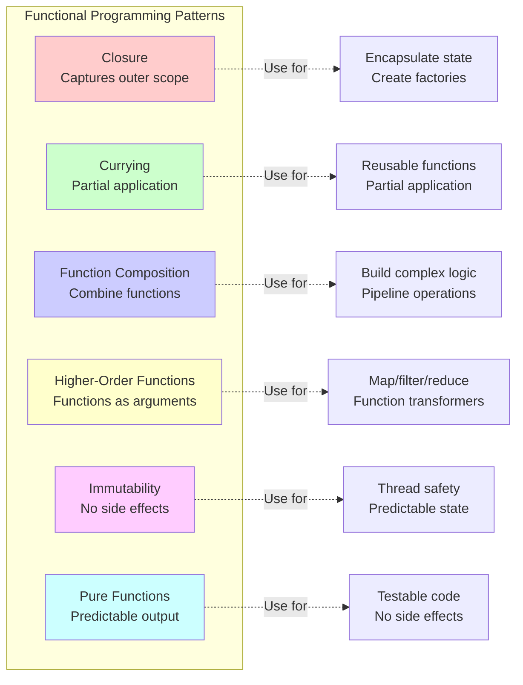
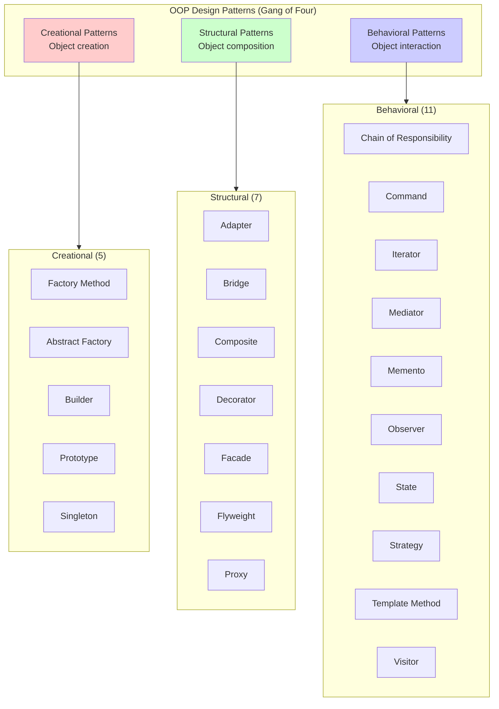
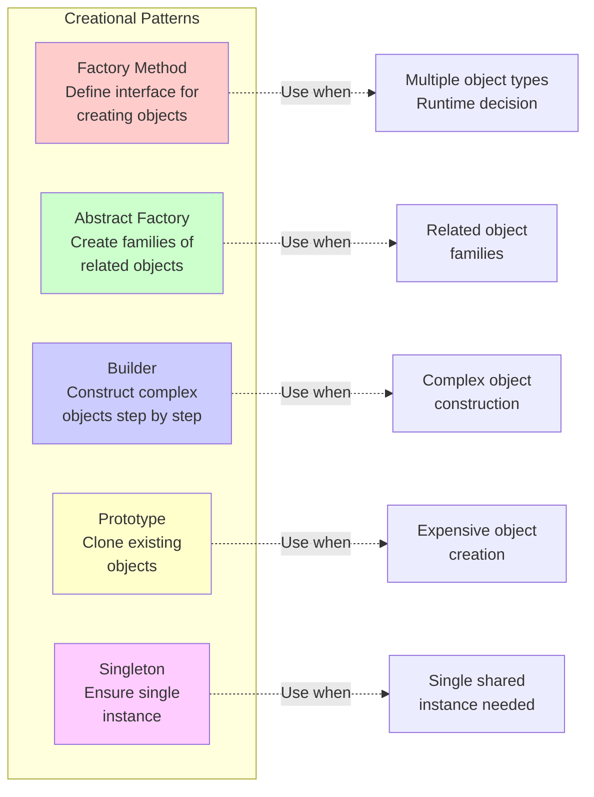
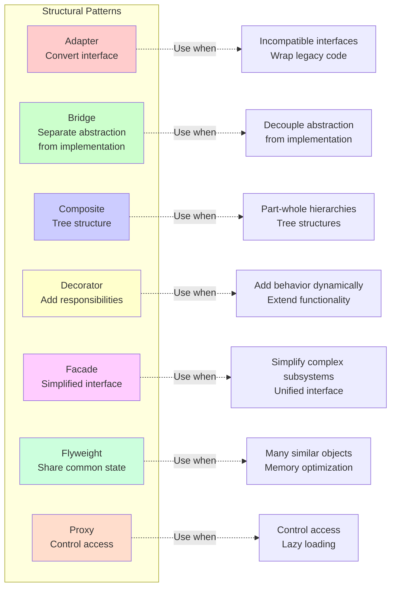
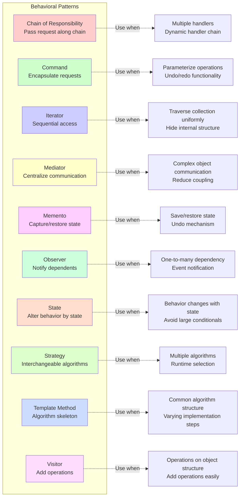

# **functional programming**

Functional programming emphasizes pure functions, immutability, and function composition to build predictable and maintainable code.



## closure

Like a backpack that remembers what you packed in it - even when you're far from home, you still have access to everything inside.

In this code, the inner function remembers the count variable from outer even after outer finishes running, so each time you call counter() it keeps counting up.

```python
def outer():
    count = 0
    def inner():
        nonlocal count
        count += 1
        return count
    return inner

counter = outer()
print(counter())  # 1
print(counter())  # 2
```

## currying

Like a vending machine where you first select the category (snacks), then the specific item (chips), then the size (large) - one choice at a time.

In this code, add(5) creates a new function that remembers 5, and when you call add5(3) it adds 5+3=8 - you're breaking down one big choice into smaller steps.

```python
def add(a):
    def inner(b):
        return a + b
    return inner

add5 = add(5)
print(add5(3))  # 8

# Practical example: Custom loggers
def create_logger(prefix):
    def log(level):
        def message(msg):
            print(f"[{prefix}] {level}: {msg}")
        return message
    return log

app_logger = create_logger("APP")
error_log = app_logger("ERROR")
info_log = app_logger("INFO")

error_log("Database connection failed")  # [APP] ERROR: Database connection failed
info_log("Server started")  # [APP] INFO: Server started
```

## higher-order functions

Like a chef who can use different cooking methods (baking, frying, grilling) on ingredients - the chef takes the cooking method as instructions and applies it.

In this code, map takes a function (lambda x: x**2) and applies it to every number in the list, filter uses a function to pick which items to keep, and reduce combines items using a function.

```python
# Map, filter, reduce examples
numbers = [1, 2, 3, 4, 5]

# Map: Transform each element
squared = list(map(lambda x: x**2, numbers))
print(squared)  # [1, 4, 9, 16, 25]

# Filter: Select elements
evens = list(filter(lambda x: x % 2 == 0, numbers))
print(evens)  # [2, 4]

# Reduce: Combine elements
from functools import reduce
sum_all = reduce(lambda x, y: x + y, numbers)
print(sum_all)  # 15

# Custom higher-order function
def apply_twice(func, value):
    return func(func(value))

def add_three(x):
    return x + 3

result = apply_twice(add_three, 10)
print(result)  # 16 (10 + 3 + 3)
```

## function composition

Like an assembly line where each station does one simple task - the product moves through each station and gets transformed step by step.

In this code, compose takes multiple functions and chains them together, so pipeline(3) does add_one(3)=4, then double(4)=8, then square(8)=64, passing the result through each function.

```python
def compose(*functions):
    """Compose functions from right to left"""
    def inner(arg):
        result = arg
        for func in reversed(functions):
            result = func(result)
        return result
    return inner

# Simple functions
def add_one(x):
    return x + 1

def double(x):
    return x * 2

def square(x):
    return x ** 2

# Compose them
pipeline = compose(square, double, add_one)
print(pipeline(3))  # ((3 + 1) * 2)^2 = 64

# Practical example: Data processing
def remove_spaces(text):
    return text.replace(" ", "")

def to_uppercase(text):
    return text.upper()

def add_prefix(text):
    return f"PROCESSED: {text}"

process_text = compose(add_prefix, to_uppercase, remove_spaces)
print(process_text("hello world"))  # PROCESSED: HELLOWORLD
```

## pure functions & immutability

Like a calculator that always gives you the same answer for 2+2=4, and doesn't change anything else in the world when you use it.

In this code, pure_add always returns 3 when you pass (1,2) and doesn't change anything else, but impure_add changes the global total variable which makes it unpredictable and harder to debug.

```python
# Pure function - predictable, no side effects
def pure_add(a, b):
    return a + b

# Impure function - modifies external state
total = 0
def impure_add(a):
    global total
    total += a
    return total

# Working with immutable data
def add_item_immutable(items, new_item):
    """Returns new list instead of modifying original"""
    return items + [new_item]

original = [1, 2, 3]
new_list = add_item_immutable(original, 4)
print(original)  # [1, 2, 3] - unchanged
print(new_list)  # [1, 2, 3, 4]

# Immutable updates for dictionaries
def update_user_immutable(user, **updates):
    """Return new dict with updates"""
    return {**user, **updates}

user = {"name": "John", "age": 30}
updated_user = update_user_immutable(user, age=31, city="NYC")
print(user)  # {'name': 'John', 'age': 30} - unchanged
print(updated_user)  # {'name': 'John', 'age': 31, 'city': 'NYC'}
```

# **object oriented programming**

Object-oriented programming organizes code around objects and classes, using encapsulation, inheritance, and polymorphism.



## oop - creation

**Creational patterns** deal with object creation mechanisms, trying to create objects in a manner suitable to the situation.



### factory method

Like a toy factory that can make different types of toys - you tell it what you want, and it creates the right toy for you.

In this code, the FactoryNike class is like a factory that can generate any Nike product (like "ao_thun" which means t-shirt) when you ask for it.

```python
class Generator:
    def generate(self, type):
        pass

class FactoryNike(Generator):
    def generate(self, type):
        return f"Nike {type}"

factory1 = FactoryNike()
print(factory1.generate("ao_thun"))
```

### abstract factory

Like getting a complete LEGO set instead of individual pieces - it gives you a whole family of matching things that work together.

In this code, the KingdomFactory can create a complete kingdom with a king, army, and castle all at once, and they all match the same theme.

```python
class KingdomFactory:
    def create_king(self): pass
    def create_army(self): pass
    def create_castle(self): pass
```

### builder

Like building a custom burger at a restaurant - you choose the bun, then the patty, then the toppings, one step at a time.

In this code, the BurgerBuilder lets you build your burger step by step - first you set the bread, then set the meat, and finally build it all together.

```python
class Burger:
    def __init__(self):
        self.bread = None
        self.meat = None

class BurgerBuilder:
    def __init__(self):
        self.burger = Burger()

    def set_bread(self, bread):
        self.burger.bread = bread
        return self

    def set_meat(self, meat):
        self.burger.meat = meat
        return self

    def build(self):
        return self.burger
```

### prototype

Like using a photocopier to make exact copies of something instead of creating each one from scratch.

In this code, the Sheep class has a clone method that makes an exact copy of the sheep, just like cloning Dolly the sheep in real life.

```python
import copy

class Sheep:
    def clone(self):
        return copy.deepcopy(self)
```

### singleton

Like having only one sun in the sky - no matter how many times you look up, you always see the same one.

In this code, the Singleton class makes sure that no matter how many times you try to create a new instance, you always get back the same one that was created the first time.

```python
class Singleton:
    _instance = None

    def __new__(cls):
        if cls._instance is None:
            cls._instance = super(Singleton, cls).__new__(cls)
        return cls._instance
```

## oop - struct

**Structural patterns** explain how to assemble objects and classes into larger structures while keeping these structures flexible and efficient.



### adapter

Like a power plug adapter that lets you use your phone charger in a different country's wall socket.

In this code, the PrinterAdapter wraps the OldPrinter so you can use its old print_old method with a new simple print method.

```python
class OldPrinter:
    def print_old(self):
        print("Old Printer")

class PrinterAdapter:
    def __init__(self):
        self.old_printer = OldPrinter()

    def print(self):
        self.old_printer.print_old()
```

### bridge

Like separating a remote control from your TV - you can change either one without affecting the other.

In this code, the Circle class can use any DrawAPI (like RedCircle) to draw itself - you can change how it draws without changing the Circle class.

```python
class DrawAPI:
    def draw_circle(self):
        pass

class RedCircle(DrawAPI):
    def draw_circle(self):
        print("Red Circle")

class Circle:
    def __init__(self, draw_api):
        self.draw_api = draw_api

    def draw(self):
        self.draw_api.draw_circle()
```

### composite

Like a folder on your computer that can contain both files and other folders, and you can treat them all the same way.

In this code, a Leaf is like a single file, and a Composite is like a folder that can hold many Leaves or other Composites - you call operation() on both the same way.

```python
class Component:
    def operation(self):
        pass

class Leaf(Component):
    def __init__(self, name):
        self.name = name

    def operation(self):
        print(f"Leaf: {self.name}")

class Composite(Component):
    def __init__(self, name):
        self.name = name
        self.children = []

    def add(self, component):
        self.children.append(component)

    def operation(self):
        print(f"Composite: {self.name}")
        for child in self.children:
            child.operation()

# Usage
leaf1 = Leaf("A")
leaf2 = Leaf("B")
tree = Composite("Root")
tree.add(leaf1)
tree.add(leaf2)

sub_tree = Composite("Sub")
sub_tree.add(Leaf("C"))
tree.add(sub_tree)

tree.operation()
```

### decorator

Like adding toppings to ice cream - you start with plain ice cream and keep adding sprinkles, chocolate sauce, and whipped cream on top.

In this code, you start with plain Coffee that costs $5, then wrap it with MilkDecorator (adds $2), then wrap that with SugarDecorator (adds $1) for a total of $8.

```python
class Coffee:
    def cost(self):
        return 5

class MilkDecorator:
    def __init__(self, coffee):
        self._coffee = coffee

    def cost(self):
        return self._coffee.cost() + 2

class SugarDecorator:
    def __init__(self, coffee):
        self._coffee = coffee

    def cost(self):
        return self._coffee.cost() + 1

# Usage
coffee = Coffee()
coffee_with_milk = MilkDecorator(coffee)
coffee_with_milk_and_sugar = SugarDecorator(coffee_with_milk)

print("Total cost:", coffee_with_milk_and_sugar.cost())  # Output: 8
```

### facade

Like a TV remote with one "power" button that turns on the TV, sound system, and cable box all at once - it makes complicated things simple.

In this code, ComputerFacade hides the complex parts (CPU, Memory, HardDrive) and gives you one simple start() button to turn on the whole computer.

```python
class CPU:
    def freeze(self):
        print("CPU freeze")

    def execute(self):
        print("CPU executing")

class Memory:
    def load(self, position, data):
        print(f"Loading {data} into memory at {position}")

class HardDrive:
    def read(self, sector, size):
        return f"Data from sector {sector}"

class ComputerFacade:
    def __init__(self):
        self.cpu = CPU()
        self.memory = Memory()
        self.hard_drive = HardDrive()

    def start(self):
        self.cpu.freeze()
        data = self.hard_drive.read(100, 20)
        self.memory.load(0, data)
        self.cpu.execute()

# Usage
computer = ComputerFacade()
computer.start()
```

### flyweight

Like a library where many people can read the same book instead of everyone buying their own copy - it saves space by sharing.

In this code, TreeFactory creates only one TreeType for "Oak Green" trees, and all 5 Tree objects share that same TreeType instead of each having their own copy.

```python
class TreeType:
    def __init__(self, name, color):
        self.name = name
        self.color = color

    def draw(self, x, y):
        print(f"Drawing {self.name} tree in {self.color} at ({x}, {y})")

class TreeFactory:
    _tree_types = {}

    @staticmethod
    def get_tree_type(name, color):
        key = (name, color)
        if key not in TreeFactory._tree_types:
            TreeFactory._tree_types[key] = TreeType(name, color)
        return TreeFactory._tree_types[key]

class Tree:
    def __init__(self, x, y, tree_type):
        self.x = x
        self.y = y
        self.tree_type = tree_type

    def draw(self):
        self.tree_type.draw(self.x, self.y)

# Usage
trees = []
for i in range(5):
    tree_type = TreeFactory.get_tree_type("Oak", "Green")
    trees.append(Tree(i, i*2, tree_type))

for tree in trees:
    tree.draw()
```

### proxy

Like a security guard who checks your ID before letting you into a building - it controls who can access something.

In this code, ProxyDatabase adds a logging message before accessing the real database, and only creates the RealDatabase when you actually need it (lazy loading).

```python
class RealDatabase:
    def query(self):
        print("Querying the real database...")

class ProxyDatabase:
    def __init__(self):
        self._real_db = None

    def query(self):
        print("Logging: Attempt to access database")
        if self._real_db is None:
            self._real_db = RealDatabase()
        self._real_db.query()

# Usage
db = ProxyDatabase()
db.query()
db.query()
```

## oop - behavior

**Behavioral patterns** are concerned with algorithms and the assignment of responsibilities between objects.



### chain of responsibility

Like asking for help at school - first you ask your friend, then your teacher, then the principal until someone can answer your question.

In this code, when you handle a request, ConcreteHandler1 tries first (handles if less than 10), and if it can't, it passes to ConcreteHandler2 (handles if less than 20).

```python
class Handler:
    def __init__(self, successor=None):
        self.successor = successor

    def handle(self, request):
        if self.successor:
            return self.successor.handle(request)

class ConcreteHandler1(Handler):
    def handle(self, request):
        if request < 10:
            return f"Handled by Handler1: {request}"
        return super().handle(request)

class ConcreteHandler2(Handler):
    def handle(self, request):
        if request < 20:
            return f"Handled by Handler2: {request}"
        return super().handle(request)

# Usage
handler = ConcreteHandler1(ConcreteHandler2())
print(handler.handle(5))
print(handler.handle(15))
```

### command

Like writing instructions on sticky notes - you can save them, pass them to others, or undo them later.

In this code, LightOnCommand is like a sticky note with instructions to turn on the light - you can pass this command to RemoteControl to execute whenever you want.

```python
class Command:
    def execute(self):
        pass

class Light:
    def turn_on(self):
        print("Light is ON")

class LightOnCommand(Command):
    def __init__(self, light):
        self.light = light

    def execute(self):
        self.light.turn_on()

class RemoteControl:
    def submit(self, command):
        command.execute()

# Usage
light = Light()
command = LightOnCommand(light)
remote = RemoteControl()
remote.submit(command)
```

### iterator

Like flipping through pages in a book one at a time - you don't need to know how the book is made, you just turn the page.

In this code, MyIterator lets you loop through items in MyCollection one by one using a for loop, without worrying about how the list is stored inside.

```python
class MyIterator:
    def __init__(self, collection):
        self._collection = collection
        self._index = 0

    def __next__(self):
        if self._index < len(self._collection):
            value = self._collection[self._index]
            self._index += 1
            return value
        raise StopIteration

class MyCollection:
    def __init__(self):
        self.items = []

    def __iter__(self):
        return MyIterator(self.items)

# Usage
col = MyCollection()
col.items.extend([1, 2, 3])
for item in col:
    print(item)
```

### mediator

Like a traffic light that tells all the cars when to stop and go - instead of cars talking to each other, they all listen to one controller.

In this code, ConcreteMediator is like the traffic light - when Component1 does action A, the mediator tells Component2 to do action B instead of them talking directly.

```python
class Mediator:
    def notify(self, sender, event):
        pass

class ConcreteMediator(Mediator):
    def __init__(self, comp1, comp2):
        self.comp1 = comp1
        self.comp2 = comp2
        self.comp1.set_mediator(self)
        self.comp2.set_mediator(self)

    def notify(self, sender, event):
        if event == "A":
            print("Mediator reacts to A and triggers B")
            self.comp2.do_b()

class Component:
    def set_mediator(self, mediator):
        self.mediator = mediator

class Component1(Component):
    def do_a(self):
        print("Component1 does A")
        self.mediator.notify(self, "A")

class Component2(Component):
    def do_b(self):
        print("Component2 does B")

# Usage
c1 = Component1()
c2 = Component2()
mediator = ConcreteMediator(c1, c2)
c1.do_a()

```

### memento

Like saving your game progress - you can go back to that exact moment later if you make a mistake.

In this code, Originator saves its state into a Memento (like a save file), then changes to State2, but can restore back to State1 using the saved memento.

```python
class Memento:
    def __init__(self, state):
        self._state = state

    def get_saved_state(self):
        return self._state

class Originator:
    def __init__(self):
        self._state = ""

    def set(self, state):
        print(f"Setting state to {state}")
        self._state = state

    def save(self):
        return Memento(self._state)

    def restore(self, memento):
        self._state = memento.get_saved_state()
        print(f"Restored to {self._state}")

# Usage
originator = Originator()
originator.set("State1")
memento = originator.save()
originator.set("State2")
originator.restore(memento)
```

### observer

Like subscribing to a YouTube channel - whenever they post a new video, all subscribers get notified automatically.

In this code, Subject is like the YouTube channel and Observers are subscribers - when you call notify(), all attached observers receive the message automatically.

```python
class Subject:
    def __init__(self):
        self._observers = []

    def attach(self, observer):
        self._observers.append(observer)

    def notify(self, message):
        for obs in self._observers:
            obs.update(message)

class Observer:
    def update(self, message):
        print(f"Observer received: {message}")

# Usage
subject = Subject()
observer1 = Observer()
observer2 = Observer()
subject.attach(observer1)
subject.attach(observer2)
subject.notify("Event occurred!")
```

### state

Like a water bottle that acts differently when it's full (heavy and steady) versus empty (light and easy to crush).

In this code, Context changes its behavior by switching between StateA and StateB - the same request() call does different things depending on which state it's in.

```python
class State:
    def handle(self):
        pass

class StateA(State):
    def handle(self):
        print("State A behavior")

class StateB(State):
    def handle(self):
        print("State B behavior")

class Context:
    def __init__(self, state):
        self.state = state

    def request(self):
        self.state.handle()

# Usage
context = Context(StateA())
context.request()
context.state = StateB()
context.request()
```

### strategy

Like choosing different ways to get to school - you can walk, bike, or take the bus depending on the weather.

In this code, Context can switch between different strategies (Add or Subtract) - you choose which strategy to use and it performs the calculation that way.

```python
class Strategy:
    def execute(self, a, b):
        pass

class Add(Strategy):
    def execute(self, a, b):
        return a + b

class Subtract(Strategy):
    def execute(self, a, b):
        return a - b

class Context:
    def __init__(self, strategy):
        self.strategy = strategy

    def do_operation(self, a, b):
        return self.strategy.execute(a, b)

# Usage
context = Context(Add())
print(context.do_operation(5, 3))
context = Context(Subtract())
print(context.do_operation(5, 3))
```

### template method

Like a recipe that has the same steps (mix, bake, cool) but you can change the ingredients to make different cakes.

In this code, AbstractClass defines the recipe (template_method does step1 then step2), but ConcreteClass can override step2 to make it do something different.

```python
class AbstractClass:
    def template_method(self):
        self.step1()
        self.step2()

    def step1(self):
        print("Step 1")

    def step2(self):
        raise NotImplementedError

class ConcreteClass(AbstractClass):
    def step2(self):
        print("Step 2 overridden")

# Usage
obj = ConcreteClass()
obj.template_method()
```

### visitor

Like a doctor visiting patients in a hospital - the doctor can do different things for each type of patient without the patients changing.

In this code, ConcreteVisitor is like the doctor who visits ElementA and ElementB - each element "accepts" the visitor and lets it do different operations on them.

```python
class Visitor:
    def visit_element_a(self, element):
        pass

    def visit_element_b(self, element):
        pass

class Element:
    def accept(self, visitor):
        pass

class ElementA(Element):
    def accept(self, visitor):
        visitor.visit_element_a(self)

class ElementB(Element):
    def accept(self, visitor):
        visitor.visit_element_b(self)

class ConcreteVisitor(Visitor):
    def visit_element_a(self, element):
        print("Processing Element A")

    def visit_element_b(self, element):
        print("Processing Element B")

# Usage
elements = [ElementA(), ElementB()]
visitor = ConcreteVisitor()
for elem in elements:
    elem.accept(visitor)
```
