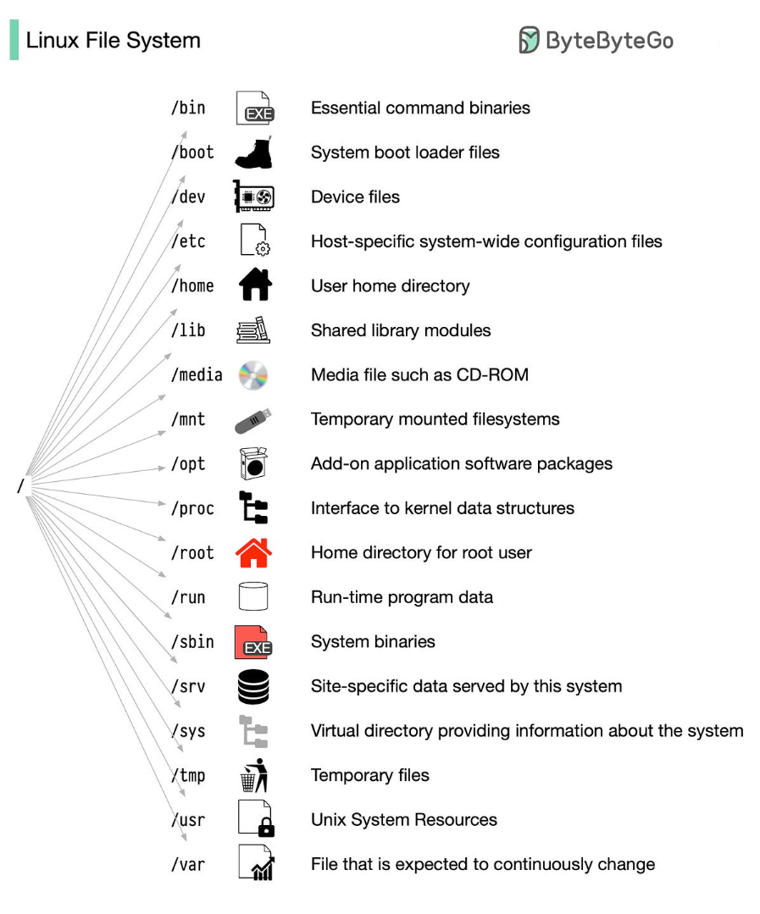

# Linux

- list all ports are running `sudo lsof -iTCP -sTCP:LISTEN -n -P`
- kill a port is running `kill -9 PID`
- copy all content in folder: `cp -r ./dist/* ~/public_apache`
- list all `service --status-all`
- start `sudo systemctl start nginx`
- stop `sudo systemctl stop nginx`

## linux file system and its feature



## systemd

saved all running services that every restart engine will be recovered

to create a new service, create a `*.servce` file in folder `/lib/systemd/system`, example: 

```
[Unit]
Description=pocketbase

[Service]
ExecStart=/root/pocketbase/pocketbase serve

[Install]
WantedBy=multi-user.target
```

common usages:

- list all running services: `systemctl | grep running`
- reload all deamon: `sudo systemctl daemon-reload`
- start a service: `sudo systemctl start your-service.service`
- enable to run service on every reboot: `sudo systemctl enable example.service`

note: systemctl is a sub command of systemd

## how to install themes in ubuntu desktop

step 1: install tweak to control themes `sudo apt install gnome-tweaks`

step 2: install `sudo apt install gnome-shell-extensions` to load local themes downloaded from the internet, to be created folders: ./themes and ./icons and then save to those locations.

structure of a theme:

- GTK: là phần giao diện giống như body của tab, alert...
- Icon: là các biểu tượng 
- GNOME shell: là top bar...

## how to install C C++

install essential tools: `sudo apt install build-essential`

---

