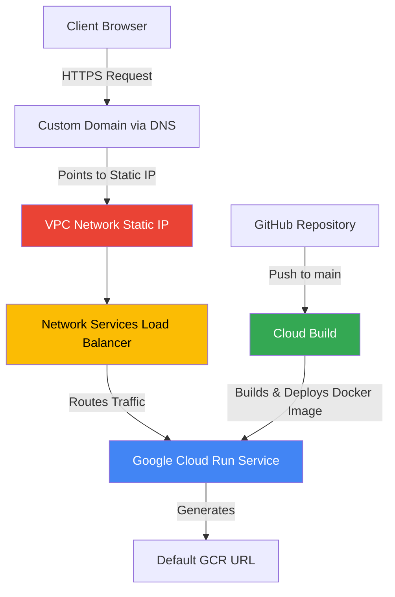
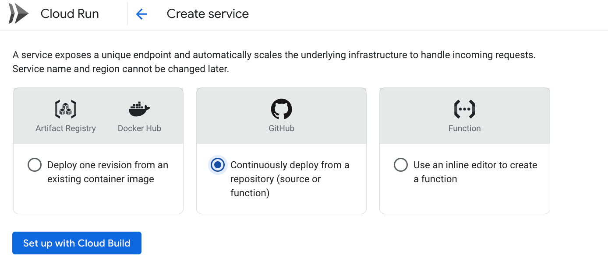
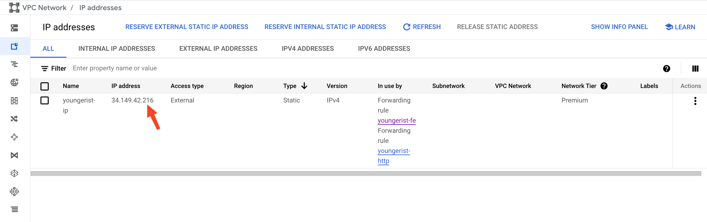
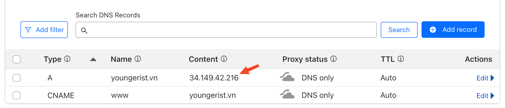
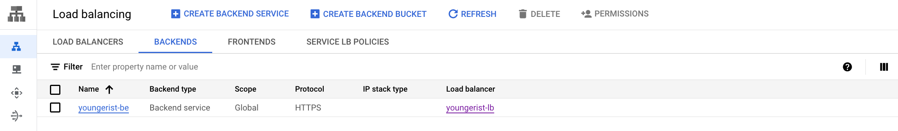

NextJS brings a number of powerful features building on top of ReactJS, allowing us to implement full-stack applications using React Server Components. However, deploying a NextJS app can be challenging, and I typically choose Vercel or Netlify providers to simplify the deployment process.

I recently joined an interesting project where the DevOps team manually deploys applications to Google Cloud Run (GCR), and I wanted to try this solution from scratch. Let's walk through the entire setup process! 😄

Here are the Google Cloud services we'll be using:

- **Google Cloud Run**: Deploy Docker images to a serverless platform
- **VPC Network**: Create static IP addresses and map them to a custom domain
- **Network Services**: Configure load balancing to route traffic to GCR
- **Cloud Build**: Connect with GitHub repository for Continuous Deployment (CD)

OK, let's go!

# 1. Google Cloud Run + Cloud Build

After finishing your NextJS application implementation, you'll need to create a Dockerfile. Here's a reference for a simple Docker configuration:

**Example Dockerfile**: [Next.js with Docker](https://github.com/vercel/next.js/blob/canary/examples/with-docker/Dockerfile)

Next, visit the Google Cloud Run dashboard and create a new service. Choose the **"Continuously deploy from a repository"** option to integrate with your GitHub repository. This enables Cloud Build to automatically deploy your application on every push to the `main` branch.

After successfully deploying your Docker container, Google Cloud Run will generate a URL similar to this: [demo link](https://youngerist-5470084010.us-central1.run.app). You can use this URL directly if your service is publicly accessible.

**Note**: While there is currently a beta feature to map a custom domain directly in Cloud Run, it's not recommended for production use. For a robust solution, we'll use VPC Networks and Network Services instead.

# 2. VPC Network + Network Services

These two services work together to map your custom domain to the URL that Google Cloud Run generated.

First, we'll create a static IP address using the VPC Network service:

Next, configure your DNS settings to point to this static IP. Here's an example using Cloudflare:

The final step is to create a load balancer that connects the static IP to your Cloud Run application using Network Services:

After completing this configuration, you can visit your custom domain and it will route directly to your Google Cloud Run service. Since Cloud Run is serverless, you don't need to worry about scaling or managing infrastructure.

**Cost consideration**: While Cloud Run itself is cost-effective with a generous free tier, using VPC Network and Load Balancer services adds approximately $20/month to your bill. This might be expensive for hobby projects or small-scale applications.

# Conclusion

- Deploying a Docker container to Google Cloud Run is an excellent option, especially if you can use the default generated URL and avoid additional network services
- There are several other serverless network services worth exploring for future optimization
- Google Cloud Run provides excellent built-in observability tools including metrics, logs, traces, and SLOs—features that typically require paid plans on Vercel or Netlify
- For production applications with custom domains, the additional $20/month for networking services may be justified by the enhanced control and observability features
