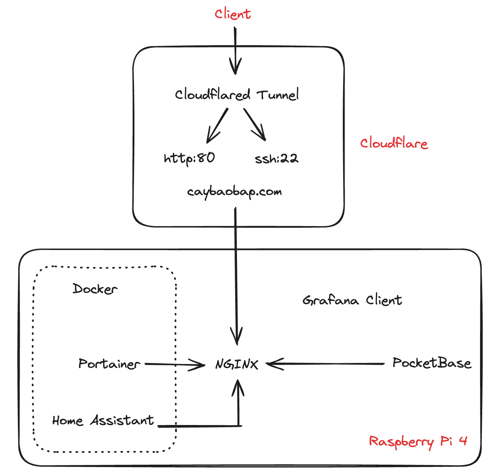
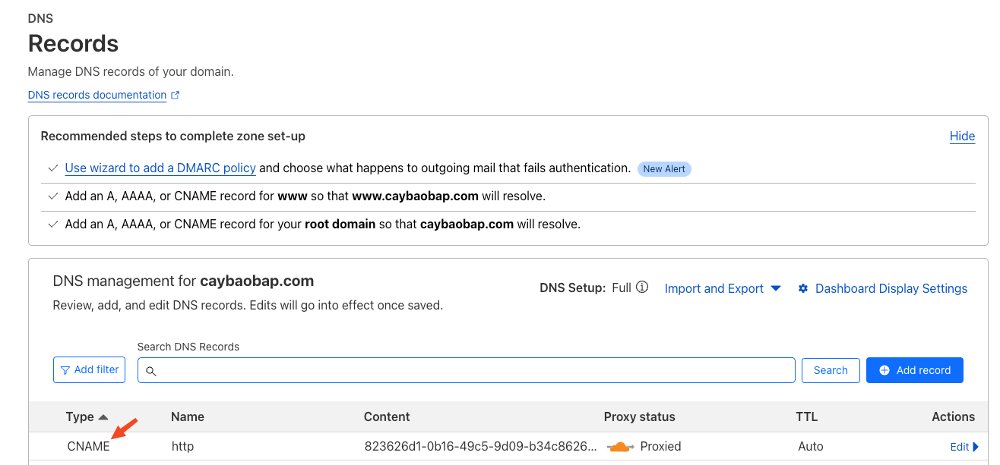
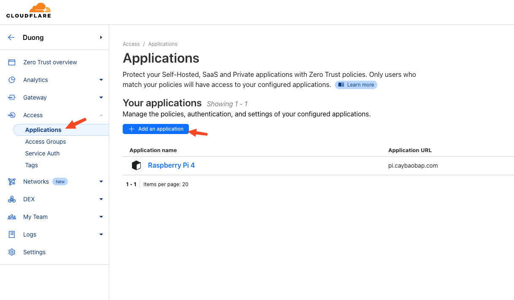
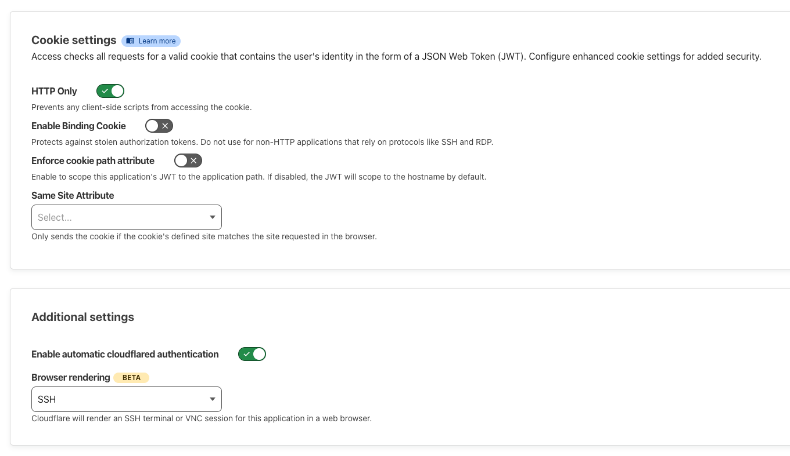
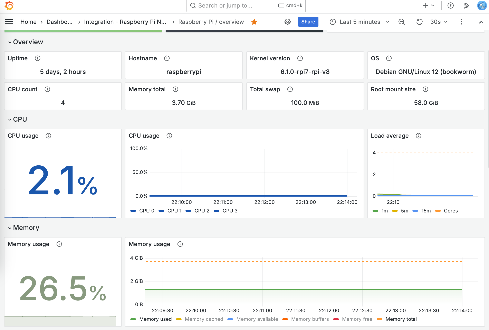
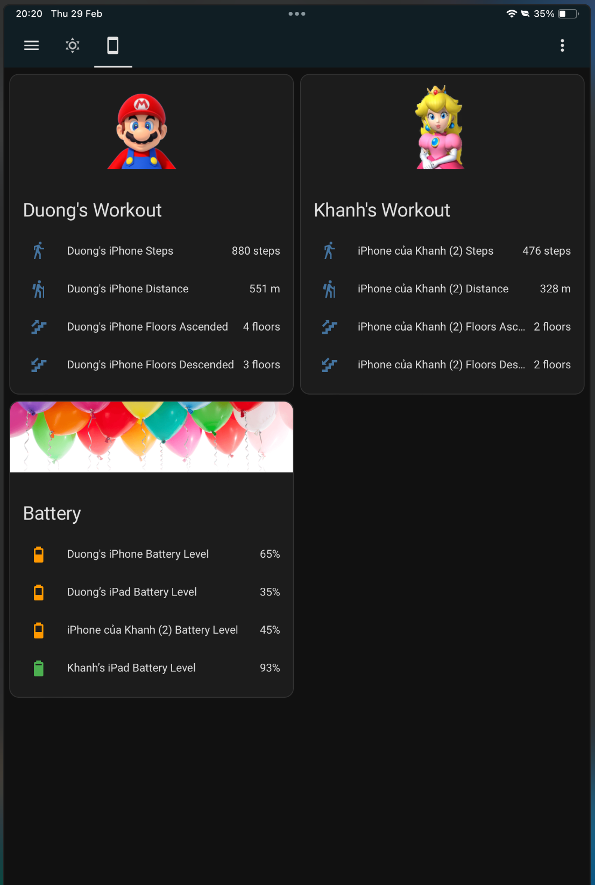

I have an idea to make an application, this time I want to try to run it on a local Raspberry machine. Also take my time to explore Home Assistant with several smart devices around.


*simple structure for the system*

Raspberry Pi OS using Debian, to check CPU arch using: `lscpu`. After some installation and services running on the machine, I need to expose or visit these pages outside of my local router network. I remembered my team used `ngrok` before for development and test a local progress. Unfortunately there is a confirm page and the CLI tool isn't friendly from my point, so I end up with Cloudflare tunnel service. And it would be easier for me as all domain DNS setup by the service.

Install `cloudflared` CLI tool:

```bash
wget https://bin.equinox.io/c/VdrWdbjqyF/cloudflared-stable-linux-arm.tgz
sudo chmod +x ./cloudflared
./cloudfalred -v
```

Create a tunnel:

```bash
./cloudflared tunnel create [name]
```

Create a config file `nvim ~/.cloudflared/config.yml` with content:

```yml
tunnel: 823626d1-0b16-49c5-9d09-b34c86266409 #from tunnel id created
credentials-file: /home/duongital/.cloudflared/823626d1-0b16-49c5-9d09-b34c86266409.json

ingress:
  - hostname: http.caybaobap.com
    service: http://localhost:80
  - hostname: ssh.caybaobap.com
    service: ssh://localhost:22
  - service: http_status:404
```

I just care about port 80 and 22, for all HTTP website and SSH from anywhere. HTTP can be public but SSH should be protected using *One Trust Application*, we do that later.

Then we need to config DNS for the domain by adding CNAME:

```bash
./cloudflared tunnel route dns 823626d1-0b16-49c5-9d09-b34c86266409 http.caybaobap.com
```


*check on dashboard to have CNAME or not*

Test the tunnel by running `./cloudflared tunnel run terminal`, the we can visit the domain to see if http response correctly.

Now we can install the service to `systemd`: 

```bash
sudo ./cloudflared --config ~/.cloudflared/config.yml
# remember this action will create another config file located in /etc/cloudflared/config.yml, we need to change it for next restart
sudo nvim /etc/cloudflared/config.yml
sudo nvim /etc/systemd/system/cloudflared.service # change root file
```

After that, the world can access our Raspberry machine, we need to handle or route requests by this is just a simple config to demonstrate:

```nginx
server {
    listen 80;
    server_name 127.0.0.1;
    location /pocketbase/ {
        proxy_pass http://localhost:8090;
    }
    location /portainer/ {
        proxy_pass http://localhost:9443;
    }
    location /homeassistant/ {
        proxy_pass http://localhost:8123;
    }
}
```

### Protect SSH on port 22 by using Application:

- Option 1: you aren't with a dev machine and trying to SSH via a browser and get security code from configured email.

This the `beta` feature to render on browser we can connect to Raspberry Pi anywhere (even mobile).


*create an application to protect ssh*


*keep all default settings but remember to enable Browser rendering*

So now every time we visit ssh.caybaobap.com, it will verify if you are the person in Policy and send 6 digits to the email.

- Option 2: you are with a dev machine

Change SSH configuration file and install `cloudflared` on local machine by following this [tutorial](https://developers.cloudflare.com/cloudflare-one/connections/connect-networks/use-cases/ssh/). This will open `cloudflared` client and a browser to authorize user, using the created tunnel and SSH to remote machine.

### Demo


*Grafana Monitoring*


*Home Assistant on iPad (the data is served from Raspberry Pi 4)*

### Lessons learn:

While using `proxy_pass` for Home Assistant, I always get an error 400 Bad Request from a different network connection. It's fine from local router network and also with PocketBase or Portainer, then I checked around the Internet and see that HA Container not exposed the port directly and there should be trusted IPs added to `configuration.yml`. I just though the reason from Cloudflared proxy or NGINX but it did't, we should check log files and see the root cause:

```bash
# NGINX
/var/log/nginx/error.log debug # add debug to see more details

# Cloudflared
./cloudflared-linux-arm tunnel --loglevel debug run 823626d1-0b16-49c5-9d09-b34c86266409
```

### Future ideas:

- Expose PostgreSQL service, maybe: sql.caybaobap.com
- Mount an micro SSD 1T to save or upload files (UI web to view Gallery)

