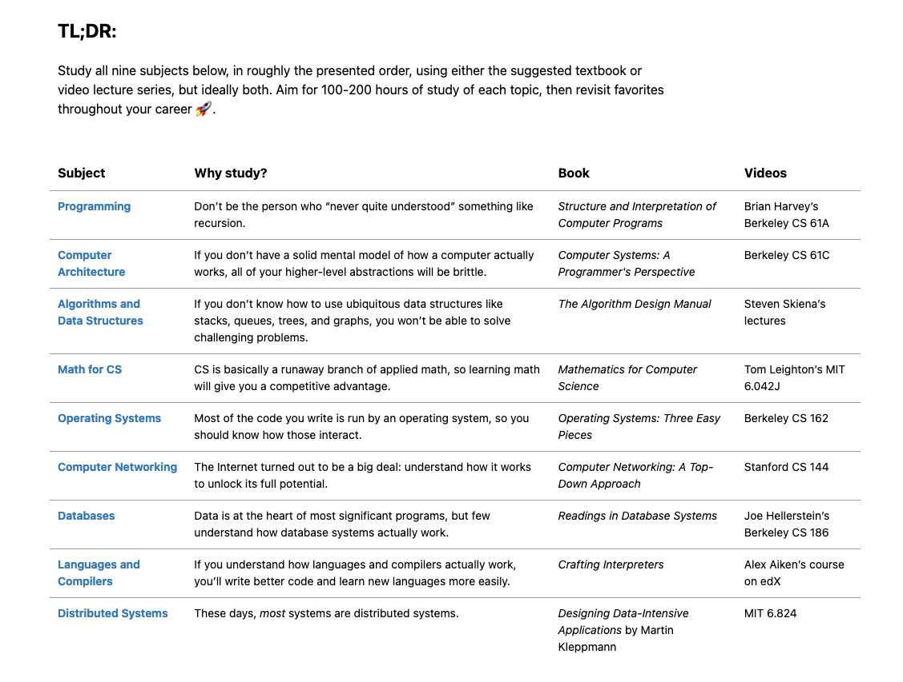

resources:

https://teachyourselfcs.com/#programming

https://www.reddit.com/r/learnprogramming/wiki/faq/#wiki_getting_started

*overview of 9 topics in computer science*

1-programing
- [ ] learn Lisp basic to understand the past
- [ ] SICP Youtube Series: https://www.youtube.com/playlist?list=PLE18841CABEA24090
- [ ] might skim the original book of SICP
- [ ] read book Composing Programs by Python

2-computer-architecture
- [x] read first chapter to the main book to have a tour then come back later

3-algorithms-and-data-structure
- [ ] read CP Handbook
- [ ] keep practicing on Leetcode

4-math
???

5-os
???

6-networking
- [x] read the CS book
- [x] note and learn on Remnote
- [ ] read the main book Networking: A Top Down Approach

7-database
- [ ] read the Red book

8-languages-and-compilers
- [ ] read the book Crafting Interpreter
- [ ] skim the main book with three heads dragon :))

9-distributed-systems
???

