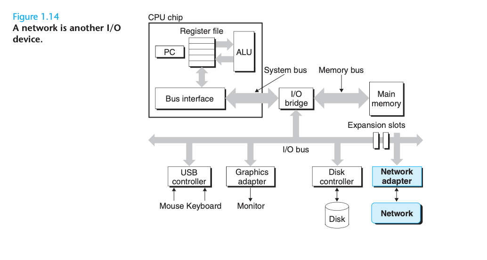
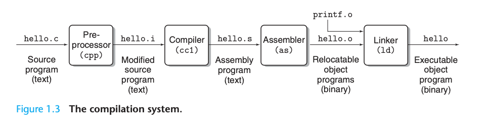
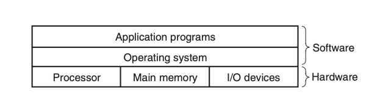

> If you don’t have a solid mental model of how a computer actually works, all of your higher-level abstractions will be brittle.

# A Tour of Computer Systems

Computer system consists of {{hardware and software}} that work together to run application programs.

Information is {{bits + context}}: all of them are bits or sequence of bytes, but in different contexts they might represent an integer, float number, car, instruction...

Networks provide ways for computer systems to communicate with one another. From the viewpoint of a particular system, the network is just another {{I/O device}}.

*Computer Architecture and Network*

Hardware organization of a typical system, including:
- Buses << transfer fixed-sized chunks of bytes known as words, most machines have word size either 4 or 8 bytes.
- I/O Devices << are the system's connection to the external world: keyboard, display, disk drive... Each device is connected to the I/O bus by either a controller or an adapter. Controllers are chip sets in the device while an adapter is a card that plugs into a slot on the motherboard.
- Main Memory << is a temporary storage device that holds both a programs and the data it manipulates while the processor is executing the program.
- Processor (CPU) << is the engine that interprets or executes instructions stored in main memory.

Four steps of GCC compiler reads the source file and translates it into an executable object file `hello`:

*The process of compiler*

Clang is frontend and LLVM is backend. `rustc` is frontend and LLVM is backend. {{GCC}} can be replaced or a competitor with LLVM.

Three benefits of understand how compilation systems work >> optimizing program performance, understanding link-time errors, avoiding security holes.

A program can't access the keyboard, display or main memory directly. Rather, they relied on the services provided by {{the operating system}}. The kernel serves as an intermediary between the application and the hardware. It provides three fundamental abstractions:
1. Files are abstractions for I/O devices. 
2. Virtual memory is an abstraction for both main memory and disks. 
3. Processes are abstractions for the processor, main memory, and I/O devices.

*OS is between app and hardware devices*

